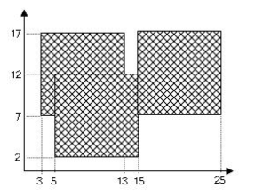

색종이
=============

가로, 세로의 크기가 각각 100인 정사각형 모양의 흰색 도화지가 있다. 이 도화지 위에 가로, 세로의 크기가 각각 10인 정사각형 모양의 검은색 색종이를 색종이의 변과 도화지의 변이 평행하도록 붙인다. 이러한 방식으로 색종이를 한 장 또는 여러 장 붙인 후 색종이가 붙은 검은 영역 넓이를 구하는 프로그램을 작성하시오.

 예를 들어 흰색 도화지 위에 세 장의 검은색 색종이를 그림과 같은 모양으로 붙였다면 검은색 영역의 넓이는 260이 된다.

<도화지 위에 놓인 세 색종이>

- - -

### 실행 조건

실행시간은 1초 이내이다.

- - -

### 입력 조건

 첫 줄에는 테스트케이스의 수 T가 주어진다.

각 테스트케이스의 첫 줄에는 색종이의 수 N이 1과 100사이의 자연수로 공백없이 주어진다.

이후 N줄에 걸쳐서 각 색종이의 정보가 공백으로 구분된 두 정수로 주어진다.

- 첫 번째 숫자는 색종이의 왼쪽 변과 도화지의 왼쪽 벽 사이의 거리이다

- 두 번째 숫자는 색종이의 아랫쪽 변과 도화지의 아랫쪽 변 사이의 거리이다.

- 모든 색종이는 도화지의 영역을 벗어나지 않는다.

- - -

### 출력 조건

 각 테스트케이스에 대하여 색종이가 차지하는 넓이를 한 줄에 공백없는 정수로 출력한다. 

- - -

### 문제 출처

 정보올림피아드
 
- - -

### 입/출력 예시

⋇ 입출력 형식을 잘 지켜주세요.

␣ : 공백 ↵ : 줄바꿈

입력 1
<pre><code>2↵
3↵
3␣7↵
15␣7↵
5␣2↵
4↵
3␣7↵
5␣2↵
15␣7↵
13␣14↵
</code></pre>

출력 1
<pre><code>260↵
336↵
</code></pre>
